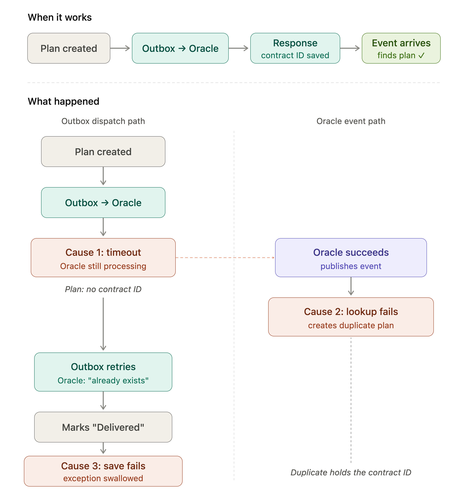

> [!artifacts] Artifacts in this case study
>
> - [The two-path convergence/divergence diagram](../attachments/outbox_oracle_event_path_divergence.png)

## What I observed

During testing, several suscription plans in the database had no contract identity even though their background jobs — queued tasks that call the external system and track whether the call succeeded — showed "Delivered" status. The external system had created the contract. The application had no record of it.

The only evidence was an error log. No alert existed for this condition. The log would eventually age out of retention.

One detail matters for everything that follows: once a job is marked "Delivered," no retry will ever fire for it again. If the contract identity wasn't saved before that moment, the gap is permanent.

## The architectural problem

The application calls an external system to create a contract. If the call succeeds, the application saves the returned identifier to a local record and marks the job as done.

But the application doesn't learn the result from just one source. The external system also publishes an asynchronous notification when it finishes. A separate processor picks up that notification and tries to match it to the local record using the external identifier.

The problem starts when the response is lost — a timeout, a dropped connection. The external system created the contract, but the application never received the identifier. Now the notification arrives, searches for a local record by that identifier, finds nothing, and creates a second record. Two local records exist for one external contract.

From there, a second problem surfaces. The original job retries and discovers the contract already exists. It has the identifier now — but saving it fails because the duplicate already holds it. The retry mechanism can repeat the external call, but it has no way to retry just the local save. The data gap becomes permanent.

The investigation surfaced two questions, each of which changed what I understood about the system.



## Question 1 — What does a timeout actually tell us?

**What I initially understood.** The first job I examined had this error from an earlier attempt:

> _The operation didn't complete within the allowed timeout of '00:00:10'_

The external system routinely takes longer than 10 seconds to process a contract creation. The HTTP client used a resilience library with two separate timeouts: a total request timeout (the outer budget across all retries) and a per-attempt timeout (applied to each individual try). The total timeout was bound to configuration. The per-attempt timeout was not — it silently defaulted to 10 seconds.

The conclusion seemed obvious: the call timed out, the external system didn't process it, the retry path would handle it.

**What changed my understanding.** The external system _had_ processed it. The contract existed. The timeout told the application it hadn't received a response in time. It did not tell the application the operation had failed. Those are different facts, and treating them as the same thing is what started the chain.

A timeout on a side-effect-free operation (a read) is safely retryable — nothing happened, try again. A timeout on a state-changing operation (a create) means "unknown." The system's recovery logic was built for "failed." It had no path for "unknown."

**What I changed.** Configured the per-attempt timeout explicitly, sized to the external system's observed processing time rather than the library's default.

**What remains uncertain.** Any delay longer than the configured timeout — a genuine outage, not just slow processing — creates the same uncertainty. The timeout fix reduces how often this triggers. It doesn't eliminate the category. A system that calls an external API to create state will always face the possibility that the call succeeded without the caller knowing.

## Question 2 — How do we recognize the same operation across independent paths?

**What I initially understood.** The application learns about completed contracts through two channels. The request path calls the external system, receives the response, and saves the returned contract identity to the local record. The notification path receives an asynchronous event from the external system and looks up the local record by that same contract identity to update it.

Under normal conditions both paths converge on the same record. The request path saves the identifier first; the notification path finds the record by that identifier and updates it.

**What changed my understanding.** When the response was lost (Question 1), the local record never received the external identifier. The notification arrived and searched for a record with that identifier. It found nothing — not because no record existed, but because the record's identifier field was still empty. The search couldn't find what was never recorded.

The notification path did what it was designed to do: it created a new record and saved the external identity there. Now there were two local records for one external contract — the original with no identifier, and a duplicate with the identifier the original should have had.

```csharp
// Notification arrives with contractId = 50421

existingPlan = db.Plans.FirstOrDefault(
    p => p.OracleContractId == 50421
);

// Returns null.
//
// The original plan exists — but its contract identity
// is still empty. The request path timed out before
// saving it. This query can't find what was never recorded.

if (existingPlan == null)
{
    plan = CreateNewPlan(contractId: 50421);   // ← duplicate
    db.Save(plan);
}
```

**What I changed.** When the primary lookup by external identifier misses, the processor now checks for a pending record — one with no external identifier and a status indicating the request path is still processing it. If found, it updates that record instead of creating a new one.

```csharp
// After: secondary correlation lookup
//
// When the primary lookup misses, check for a record the
// request path created but hasn't finished processing —
// no external identifier, pending status.

existing = db.Plans.FirstOrDefault(
    p => p.OracleContractId == contractId
);

if (existing == null)
{
    pending = db.Plans.FirstOrDefault(
        p => p.CustomerId == customerId
          && p.OracleContractId == null
          && p.Status == "Pending"
    );

    if (pending != null)
    {
        ApplyEventData(pending, event);    // ← update, not create
        db.Save(pending);
    }
    else
    {
        plan = CreateNewPlan(contractId);  // genuinely new
        db.Save(plan);
    }
}
```

## The interaction

The 10-second default is merely unconfigured. The notification processor is doing its job correctly given what it can see.

The bug is the interaction between both causes. It exists only in the space between components, where no single component has a complete view of the lifecycle: the request path doesn't know the external system succeeded and the notification path doesn't know the request path is about to retry.

| #   | Cause                                                                                           | What it did                                                                                             |
| --- | ----------------------------------------------------------------------------------------------- | ------------------------------------------------------------------------------------------------------- |
| 1   | Per-attempt timeout shorter than the external system's real processing time                     | External system succeeded but the application saw a timeout; identifier never received                  |
| 2   | Notification path couldn't find the original record (no identifier yet) and created a duplicate | Two records for one contract; the idempotency guard couldn't recognize the original was already handled |

## What it cost

**Manual backfill.** Records already affected require manual reconciliation — matching the duplicate record's contract identity back onto the original, then merging or removing the duplicate. This is an operational cleanup task, not something the code fix resolves.

**The deeper gap.** The two processing paths — request and notification — have no shared awareness of each other's progress. The fixes address the specific ways this gap manifested in this incident. A different interaction pattern between the same two paths could surface a different symptom of the same underlying separation. The paths are decoupled by design, for good reasons — but the cost of that decoupling is that neither path can tell when the other has partially completed work on the same record.
